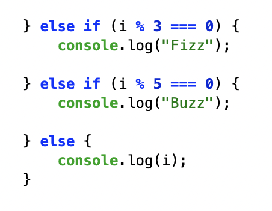

# FizzBuzz

## Outline

At first, I didn't immediately think about how to structure the code. However, I recalled the control flow examples that I practiced in class, especially the "for loop" and other conditional statements (if, else if, else). I realized that this assignment was not about complex math things, but about organizing logic in the correct order.

I began by thinking about the repitatoin first. I knew that the code in this assignment needs to check every integer between 1 and 100. I decided to use a "for loop".

After then, I made the conditions with these three cases.

I separated each condition statements(if, else if, else) and made it step by step.

I think most important thing in this assignments is leaning importance of the order. I placed the condition for numbers divisible by both 3 and 5 at the top, because if I checked divisibillity by 3 first, numbers like 15 would incorrectly print "Fizz" instead of "FizzBuzz". Organizing the conditions helped me understand how control flow determines program behavior.

## The part I found difficult

I struggled about "What is the appropriate order?". At first, my code didn't work well because it was in the wrong order. As I mentioned earlier, hte case that is divisible by both 3 and 5 should have been placed first, but that wasn't the case, so the code didn't work properly. However, once I knew the importance of order, so I coded again and finally got the results I wanted.
