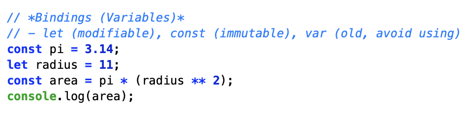

# FtoC

## Outline

At first, I didn;t know how tp create a converter. I recalled the code I learned in class to calculate the area of a circle and thought about the calculatoin step by step. Like calculating the area of a circle, I first distinguished between constant and variable values (const,let). Then, I came up with a structure that would write the calculation process in order.

And then, I identified the formula for converting Fahrenheit to Celcius: {(Fahrenheit - 32) 5 / 9}. Since the formula was already provided, I didn;t neet to rethink the math. Instead, I focused on to divide the calculation process into steps and translated it into given code.

I defined the "const" and "let" values, and then appropriately placed the given formula within the code before the result. By organizing the flow of calculation by assigning values to variables rather than viewing the formula as a single statement, I was able to understand the process, not just the substitution.

## The part I found difficult

Although the formula was already provided, when I actually tried to write the code, I felt difficult to know where to place each value. In particular, I was confused about the order in which to calculate 32, 5, and 9, and which value should be stored in the variable first.

Therefore, I broke the calculation down into steps. I thought and wrote the code by following the exact sequence(subtract 32 from the Fahrenheit value, then multiply that result by 5, and then divide by 9). As I stored the values in variables and observed the claculation flow, the role of each number became increasingly clear.