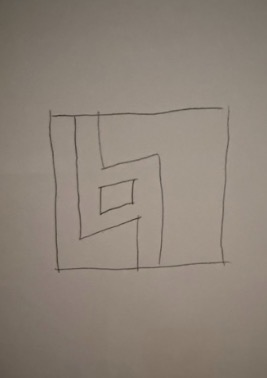
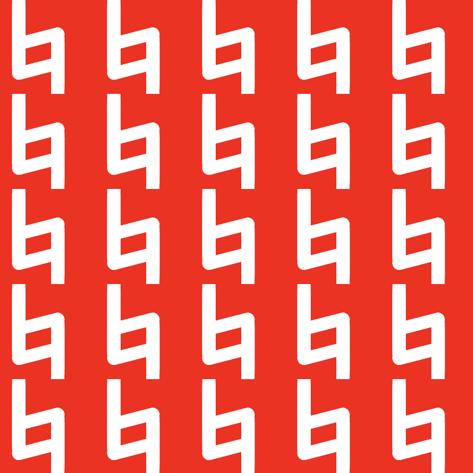
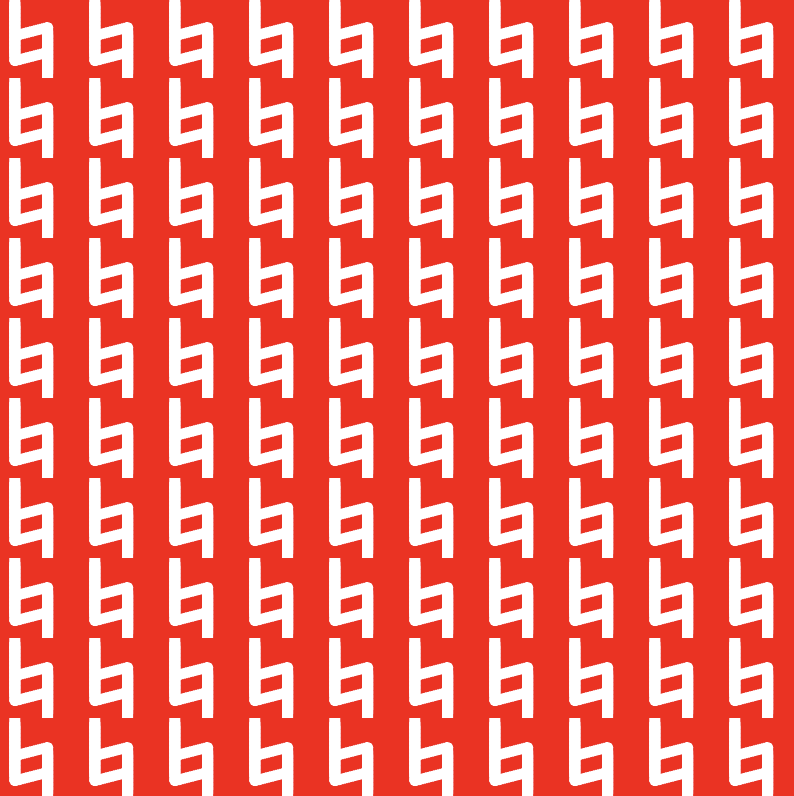
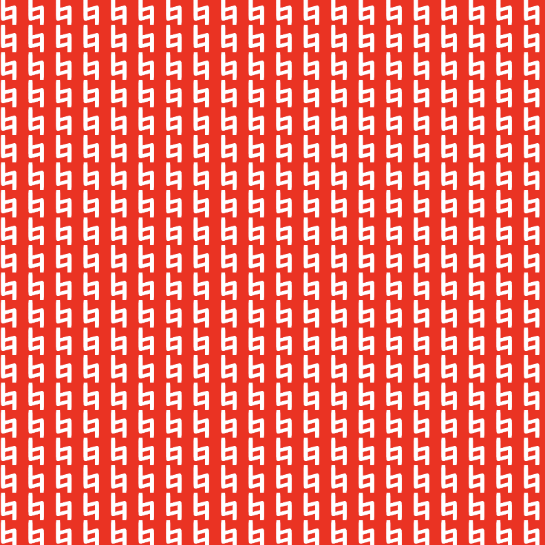

# Midterm


## Phase 1



Yay

## Phase 2


Entire code

```javascript
function setup() {
  createCanvas(400, 400);
  noStroke();
}
function draw() {
  background(255, 0, 0);
  fill(255);
  for (let y = 0; y <= 260; y +=20) {
    square(56, y, 56)
  }
  square(56, 285, 56, 50);
  for (let y = 344; y >= 144; y -=20) {
    square(220, y, 56)
  }
  square(220, 120, 56, 50);
  quad(88, 160, 244, 120, 250, 174, 88, 216);
  quad(88, 285, 244, 245, 250, 299, 88, 341);
}
```

First, I created a canvas using the setup() function, and I alsos used noStroke() so that the shapes are drawn without outlines

```javascript
function setup() {
  createCanvas(400, 400);
  noStroke();
}
```

And I drew the red background with (255, 0 , 0) which is the (R, G, B), also I drew the Berklee logo with a lot of shapes. I used loops to create and refine multiple shapes into the shape I wanted.

```javascript
function draw() {
  background(255, 0, 0);
  fill(255);
  //this is the shape in the left
  for (let y = 0; y <= 260; y +=20) {
    square(56, y, 56)
  }
  square(56, 285, 56, 50);
  //this is the shape in the right
  for (let y = 344; y >= 144; y -=20) {
    square(220, y, 56)
  }
  square(220, 120, 56, 50);
  //this is the shape in the top
  quad(88, 160, 244, 120, 250, 174, 88, 216);
  //this is the shape in the bottom
  quad(88, 285, 244, 245, 250, 299, 88, 341);
}
```

The most challenging part of this process was designing parts without sharp corners. There were several issues with the layout of the shapes, such as not achieving the angles and widths I had envisioned. However, I solved these problems by plugging in numbers one by one.

Also, for example, originally the shapes were arranged like this, but by using a loop, the length could be efficiently reduced.

```javascript
  //this is the shape in the right
  square(220, 344, 56);
  square(220, 324, 56);
  square(220, 304, 56);
  square(220, 284, 56);
  square(220, 264, 56);
  square(220, 244, 56);
  square(220, 224, 56);
  square(220, 204, 56);
  square(220, 184, 56);
  square(220, 164, 56);
  square(220, 144, 56);
  square(220, 120, 56, 50);
  ```


## Phase 3

Entire code

```javascript
function setup() {
  createCanvas(400, 400);
  noStroke();
}
function drawObject(x, y, s) {
  push();
  translate(x, y);
  scale(s);
  fill(255); 
  for (let y = 0; y <= 260; y +=20) {
    square(56, y, 56)
  }
  square(56, 285, 56, 50);  
  for (let y = 344; y >= 144; y -=20) {
    square(220, y, 56)
  }
  square(220, 120, 56, 50); 
  quad(88, 160, 244, 120, 250, 174, 88, 216); 
  quad(88, 285, 244, 245, 250, 299, 88, 341);
  pop();
}
function draw() {
  background(255, 0, 0);
  drawObject(0, 0, 1);
  drawObject(0, 0, 1);
}
```

In Phase 3, the goal was to make the visual object easier to reuse and modify. Instead of drawing all shapes directly in the draw function, I organized the code into a function.

I created a function called drawObject and moved all the drawing code into it. This allows the same object to be drawn multiple times in different positions and sizes

```javascript
function drawObject(x, y, s){
}
```

To control the position, I used translate(x, y). This moves the coordinate system so that I don't need to change the coordinates of every shape.

```javascript
translate(x, y);
```

To control the size, I used scale(s). This scales the entire object, making it easy to draw it larger or smaller

```javascript
scale(s);
```

push & pop

The functions created earlier affect other codes, so each object was created independently by using push and pop.

```javascript
push();
pop();
```

Finally, by calling drawObject, we can reuse the same object in different locations. Phase 3 seems to be a preparation for phase 4. During this process, it became possible to easily create repetitive patterns by saving and loading shapes as functions.


## Phase 4

In Phase 4, the goal is to tile the canvas with the object that created in Phase 3. Instead od drawing a single object, now we repeat it multiple times in a grid layout.

Entire code

```javascript
function setup() {
  createCanvas(400, 400);
  noStroke();
}
function drawObject(x, y, s) {
  push();
  translate(x, y);
  scale(s);
  fill(255);
  for (let y = 0; y <= 260; y +=20) {
    square(56, y, 56)
  }
  square(56, 285, 56, 50);
  for (let y = 344; y >= 144; y -=20) {
    square(220, y, 56)
  }
  square(220, 120, 56, 50);
  quad(88, 160, 244, 120, 250, 174, 88, 216);
  quad(88, 285, 244, 245, 250, 299, 88, 341);
  pop();
}
function draw() {
  background(255, 0, 0);
  let cols = 5;
  let rows = 5;
  let cellWidth = width / cols;
  let cellHeight = height / rows;
  let objectSize = 400;
  let s = cellWidth / objectSize;
  for (let i = 0; i < cols; i++) {
    for (let j = 0; j < rows; j++) {
      let x = i * cellWidth;
      let y = j * cellHeight;
      drawObject(x, y, s);
    }
  }
}
```

First, I defined the number of columns and rows. This creates a grid on the canvas.

```javascript
  let cols = 5;
  let rows = 5;
  ```

Next, I calculated the width and height of each grid cell by dividing the canvas size by the number of rows and columns.

```javascript
  let cellWidth = width / cols;
  let cellHeight = height / rows;
  ```
  
And I calculated the scale by dividing the grid cell size by the original object size so that the object fits inside each grid cell.

  ```javascript
  let objectSize = 400;
  let s = cellWidth / objectSize;
  ```
  
Next, I used loops to repeat the object across the grid. The position of each object was calculated using the grid index

```javascript
  for (let i = 0; i < cols; i++) {
    for (let j = 0; j < rows; j++) {
      let x = i * cellWidth;
      let y = j * cellHeight;
	  ```

Finally, I drew the object by calling the drawobject() function to draw at each grid position.

```javascript
	  drawObject(x, y, s);
	  ```
	  
Also I can change the amount of objects by adjusting number of

```javascript
  let cols = 5;
  let rows = 5;
  ```
  
Generated Image

5x5



10x10



20x20


  
Through this project, I learned how to build a complex structure with using simple shapes in javascript. I also learned how functions can make code more reusable and organized. Additionally, using loops helped me understand how patterns and grid layout can be generated efficiently on the canvas.


